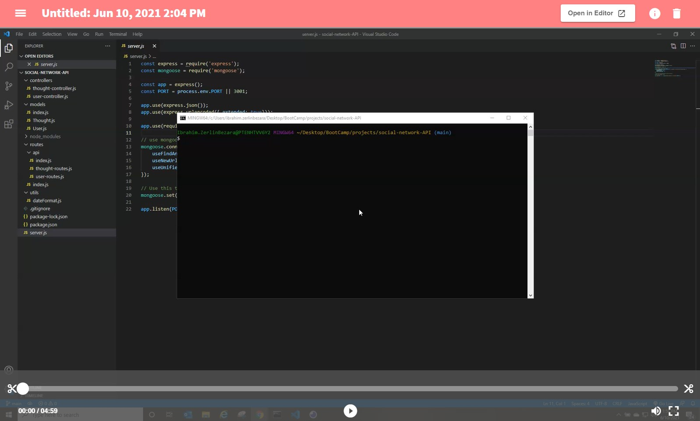

# Social-Media-API 

  

  ## Description
  Social Media API is an back end application created to serve a social media front end. The back end uses NoSQL MongoDB database to store data for Users, Thoughts and Reactions to the thoughts. The app allow users to have connection with other users (friends). Users and thoguths can be created, read, update it or delete it (CRUD). Friends and Reactions can be create it or delete it. The app uses different NPM packages like express-js and mongoose. The add allows the front end developer to hadle. 

  ## Table of Contents
  * [Video](#Video)
  * [Installation](#installation)
  * [Usage](#usage)
  * [Contribution](#contribution)
  * [License](#license)
  * [Questions](#questions)

  ## Video

  
 

  
  ## Installation
  To install first make sure you have node.js installed in your computer. Copy the repository and run NPM install on the same directory to install all dependencies in the package.json file. Make sure MongoDB is intalled in your computer to be able to run the aplication. 
  
  ## Usage
  Run NPM start to start the server first. Open your from end page or use a tester software like insomnia to test the routes to create, read, update and delete Users or thoughts. Also you will be able to create and delete friends and reactions to thoughts.

  ## Contribution
  Anybody is free to contribute to this project as desired. Just contact me via email to present your new ideas to add to this project.

  ## License
  This project was done under the MIT license to know more about it, please click here: [MIT](https://choosealicense.com/licenses/mit/)

  ## Questions
  Please visit my GitHub page: https://github.com/hbbc248
  
  For more information please email me at: ibrahimzerlin@hotmail.com